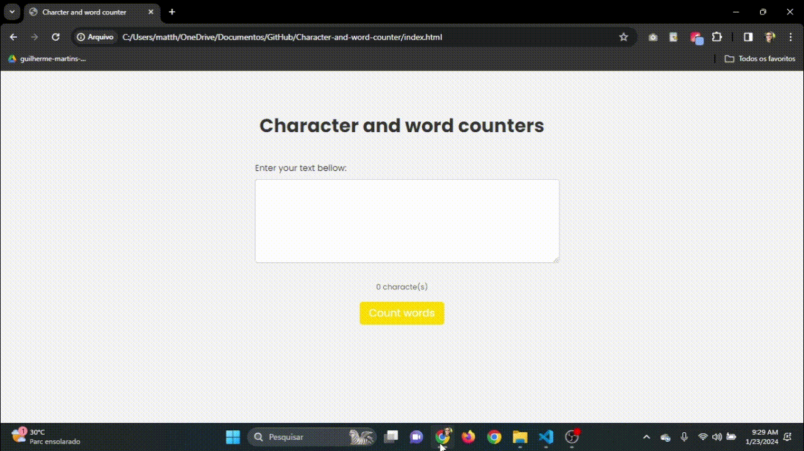

# Character and word counter thumbnail

Word and Character Counter Project

## Overview

This project uses JavaScript features and DOM (Document Object Model) manipulation to create an interactive character and word counting tool. 

## Project photos

    - result of the Vercel project: https://character-and-word-counter-js.vercel.app/

## Tools used:
    - JavaScript
    - Html
    - CSS

## How it works

1. ### features
    - counts characters
    - counts words

## Contact ✉️

- Email: mattheusp382@gmail.com
- LinkedIn: [Mattheus-Pereira](https://www.linkedin.com/in/mattheuspereira/)
- Portfolio: [mtp-dev.com](https://mtpdev.com.br/)

## Contribution 🤝

If you want to contribute to a project or encounter a problem, feel free to open a new issue or send a pull request. Any contribution is welcome!

## License📄 

This portfolio is licensed under the [MIT License](https://opensource.org/licenses/MIT).